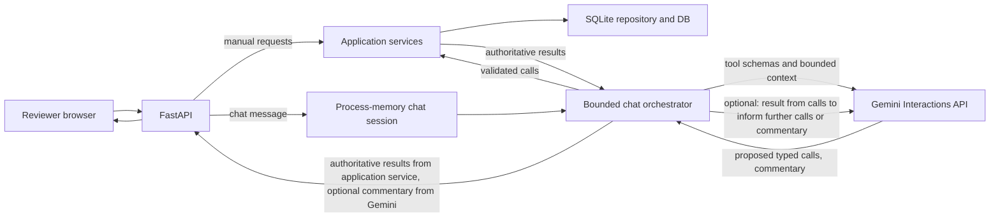

# Construction Material Inventory Assistant

## Overview
This repository implements the construction material inventory assistant as described in [`Requirements/README.md`](Requirements/README.md). The app supplies both a chat assistant powered by Gemini API capable of answering questions and performing actions for the user and a traditional human-oriented UI that enables manual operations. 

However, note that the resulting response from actions performed by the chat assistant is directly presented to the user deterministically instead of fed through the chat assistant and formed into natural language to avoid hallucination twisting the facts, though the chat assistant can still see the result and attempt to comment on or summarize the action.

A live demo can be found at <https://sidian-inventory-assistant-demo.onrender.com>. It requires basic HTTP username-password authentication to prevent random entities of the internet from interacting with the chat assistant and exhausting the limited free tier Gemini API usage.

## How to run it locally

Python 3.13 is required. From PowerShell:

```powershell
python -m venv .venv
.\.venv\Scripts\python.exe -m pip install -r requirements-dev.txt
$env:DEMO_USERNAME = "demo"
$env:DEMO_PASSWORD = "choose-a-long-random-password"
$env:GEMINI_API_KEY = "your-gemini-api-key" # replace this with your own Gemini API key to enable chat assistant functionality
.\.venv\Scripts\uvicorn.exe inventory_assistant.main:app --app-dir src --reload
```

Open <http://127.0.0.1:8000/> and enter the credential configured with `DEMO_USERNAME` and `DEMO_PASSWORD`. Without `GEMINI_API_KEY`, the catalogue and deterministic inventory and order operations continue to work, but chat interpretation is offline.

The committed [`.env.example`](.env.example) lists all settings without real secrets. Either set
them in the shell or copy the template to an ignored `.env` and add `--env-file .env` to the
Uvicorn command. The application does not otherwise load `.env` automatically.

*Note: You shouldn't need to touch this, but for information purposes, `INVENTORY_DATA_PATH` can override the default `Requirements/inventory_data.json` data source ingested and `INVENTORY_DB_PATH` can override the default `var/inventory.sqlite3` database destination. This means you can ingest a different data set and have it output the database to a different location.*
`GEMINI_MODEL` defaults to `gemini-3.5-flash-lite`, which is recommended because it has the highest usage allowance in what I can find under the free tier, but you can change to other models if your API key comes with generous usage availability.
`CHAT_COOKIE_SECURE` defaults to `false` for local HTTP and is set to `true` on Render for the live demo.

You can additionally run the provided test suite with:

```powershell
.\.venv\Scripts\ruff.exe check .
.\.venv\Scripts\ruff.exe format --check .
.\.venv\Scripts\pytest.exe
```

The [`bruno`](bruno) collection provides requests that can be run by a human locally to test out the endpoints available. Its environment reads
`DEMO_USERNAME` and `DEMO_PASSWORD` from the Bruno process. You can run these against local with the Bruno app or CLI for manual testing if desired.

## Database schema and rationale

The application ingests the supplied JSON into three SQLite `STRICT` tables:

| Table | Purpose |
|---|---|
| `inventory_snapshot` | One row containing dataset metadata, source definitions, source filename, exact-byte SHA-256, byte length, ingestion time, schema version, and record counts. |
| `suppliers` | One row per case-insensitive supplier ID, including location, payment terms, lead time, and source order. |
| `materials` | One row per case-insensitive SKU, linked to its supplier and containing catalogue, price, inventory, warehouse, and discontinued fields. |

Suppliers and materials are normalized because each has its own identity and one supplier serves many materials. Snapshot metadata is separate so provenance is recorded once rather than repeated on every material. Category, supplier, and warehouse indexes support the application's lookup paths. Foreign keys, integrity constraints, and strict typing reject malformed relationships and values.

Availability is deliberately computed instead of stored. Domain code always derives `qty_available = qty_on_hand - qty_reserved` at runtime, which prevents drift of a hypothetical availability column as `qty_on_hand` and `qty_reserved` are updated. Prices are stored as integer cents and exposed through decimal arithmetic due to the need for exact values and lack of MySQL `Decimal()` equivalents in SQLite (while all other numeric types like floating point suffer from inprecise values, which is bad news for dealing with money).

At every process start, ingestion validates the complete JSON, constructs a sibling temporary database, checks foreign keys, integrity, provenance, and JSON/repository parity, and atomically replaces the previous session database only after every check passes. The same repeatable operation is available through [`scripts/ingest.py`](scripts/ingest.py). A failed ingestion preserves the prior valid file. Because this demo is a proof-of-concept project, I used the SQLite that Python came with for ease of use and expediency, instead of a PostgreSQL system with migration that I would normally use for formal projects.

## Business rules implemented

All supplied business rules are implemented:

| Rule | Implementation |
|---|---|
| Derive availability | Raw availability is on-hand minus reserved. A separate `qty_shippable = max(qty_available, 0)` prevents negative stock from being described as shippable. As a bonus, overallocations also trigger a notification banner on top in hopes that the user is reminded to either order more or pull it out of thin air (except neither functionality is required or implemented). |
| Reserve order rather than ship | A confirmed customer order increases `qty_reserved` and never decreases `qty_on_hand`, as required. |
| Reject order on insufficient inventory | The request is rejected along with a response that states available quantity. |
| Reject order on discontinued materials | Ordering is rejected even when physical stock remains (which puzzles me, as I would want to clearance sale the remaining inventory, but that is what the requirement states). |
| Never invent a SKU | Matching returns exact, unique, ambiguous, or no-match outcomes, so no fuzzy substitutes in the search layer. This deterministic result is then directly shown to the user as the authoritative source, with chat assistant only being able to comment but not modify or twist the results. Additionally, chat assistant would be censored when attempting to make up fake SKUs, which we can detect by checking whether the authoritative response contains said SKUs. |
| `min_order_qty` for restocking only | Supplier minimums do not restrict customer orders. |
| Calculate line totals | Application code multiplies unit price by quantity to get line total and returns it. If order cannot be placed, the total is stated as hypothetical and still returned (assuming an exact match for the item is found; can't calculate if we don't know for certain what is being bought). |

As an additional detail, Ordering uses an evaluate-then-confirm workflow. Evaluation is read-only and returns whether the order can be placed and the line total. If order is valid, an opaque confirmation token valid for 15 minutes is created, and replaying a consumed token returns its cached terminal result without reserving twice.

## Assumptions and liberties taken

- The software is for an internal use case that prioritizes reliability and safety with a human operator in control. Therefore a complete UI usable by a human is provided, with the chat assistant as only an assistant rather than the only interface for performing operations. This way, the human does not need to depend on the chat assistant to verify information and perform actions, but it is still available for convenience and efficiency.
- Inventory and customer-order quantities are always integers, i.e. ordering fractional construction material is a felony and individuals who order 2/3 of a rebar are all put in jail.
- All prices in the dataset are in CAD, and sales taxes don't exist.
- Since it's a demo only, we do not care to persist data after it shuts down.

## What I would do with another week

In no particular order:

1. Replace SQLite with PostgreSQL that includes migration and data persistence.
2. Add order tracking and cancellation, where you can check and cancel orders by order number.
3. Add functionality for actually replentishing stock, such as receiving new shipments. This would allow actually resolving overallocations.
4. Polish the UI to be more descriptive and streamlined when showing operation results, and fine tune how we censor the chat assistant when it tries to spread fake news. It is probably better to not show the LLM output at all than just displaying the cryptic error message as we do right now.
5. Add other LLM implementations that turns the app agent-agnostic instead of only using Gemini.
6. Use docker for consistent deployments.
7. Given more budget as well as time, integrate better processing, session memory, and validation for the chat assistant (which necessarily involves paying for more powerful LLM usage).

## Design write-up and system flows


As mentioned in the assumptions section, this app prioritizes human control and factual reporting, therefore the user has both a chat assistant and a manual interface for performing operations, as indicated in the flow chart. However, if you ignored the manual requests flow, the rest is a complete picture of the chat assistant-only flow.

When a user sends a chat message, it goes into the chat session with memory first, so that user does not lose the chat when they navigate or refresh. This is then fed into the orchestrator, who passes it to Gemini to decide which supplied tool calls it should make (ignore the optional results from calls for now, we will come back to it). Gemini then returns the tool calls back to the orchestrator, who makes these calls to the application services. The application services process the requests with data from the SQLite DB and returns the results. orchestrator then passes these results directly to the user, which would be authoritative since it does not go through Gemini at all and therefore cannot be twisted and guarantees accuracy.

Now we can address the other flows in the chart (some optional, some not): when call results from the Application services are delivered to the orchestrator, it also passes a copy to Gemini for it to generate commentary in addition to providing the user with authoritative results. This commentary is then passed back to orchestrator to check for truthfulness, and as mentioned previously in business logic, any made up SKU or other quantitative data not matched to content in the call results would cause the commentary to be sensored, thereby preventing LLM hallucination from reaching the user.

Also, when Gemini receives the user's chat message context, it might decide to do multiple sequential calls that depend on each other. Currently, that would happen when trying to place an order, where Gemini must send an evaluate order request first and then only send the place order request after obtaining explicit permission from the user, who presumably has reviewed the order evaluation results. This is what the optional result from calls flow is for: sometimes the results don't just inform the commentary, but also subsequent execution. 

TL;DR: the boundary between the LLM and my code is the orchestrator, which only allows LLM to pass application requests and commentary on results, while results produced by application are sent directly to user to prevent LLM hallucination tampering. The alternative that I wanted to avoid with this is passing all results through the LLM for intepretation in order to present the user with nicely worded results, but that risks aforementioned tampering, and I assume a user would rather receive messy data than incorrect data.

*Now what happens if we abuse the chat assistant with unreasonably large instructions?*

For example, let's say I asked to place an order for 500 of everything in the catalogue. In this case, orchestrator would simply give up processing the remaining requests after 5 routing interactions or 10 proposed calls, as set in the rules. Consider this a fuse of sorts; if I didn't do this, the LLM will probably break in novel and interesting ways from the overload. Or maybe it won't break, which would be way worse, because it will just burn all your tokens instead before it hits the rate limit. Also, if the supplied data is sufficiently messy, the deterministic matching mechanism can also fail, potentially before the LLM, but there is an argument to be made that it is a data sanitation problem instead of a design one (for which I have no solution other than endlessly complain to and nag the data supplier).

## Closing thoughts

Everything built here are vibecoded and most choices are made for sake of expediency, other than the core data reliability consideration. This is why pretty much everything you can see has poor scalability and/or tightly coupled to each other, most evident by the monolithic structure. But doing it the "proper" way and making everything into nice and independent microservices would be beyond my abilities given the time constraint. Maybe some madlad out there can do it though. (Besides, it's not like there aren't scaling advantages to modular monolithic architectures; problem is it does not apply due to the demo nature, so all that's left is me trying to be ~~lazy~~ quick and dirty.)

The code has also never been reviewed up close, and there are scarcely any debugging mechanism. However, I believe I addressed a good amount of these in the "what I would do with another week" section. I had a lot of fun with this exercise, and I hope you also did reading what I wrote.

*P.S. feel free to check the `AGENTS.md` file to see all the rules I set for my LLM, the iterative steelthread design and implementation process, and all the haphazard notes it compiled for me about the implementation and future improvements, many of which are not exactly accurate.*